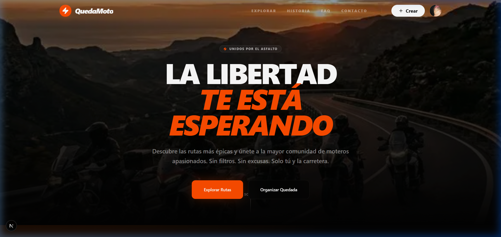
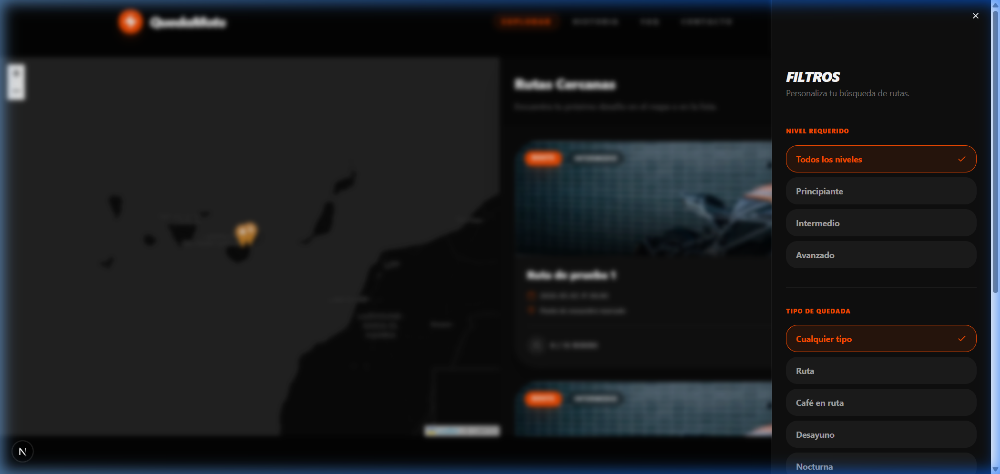
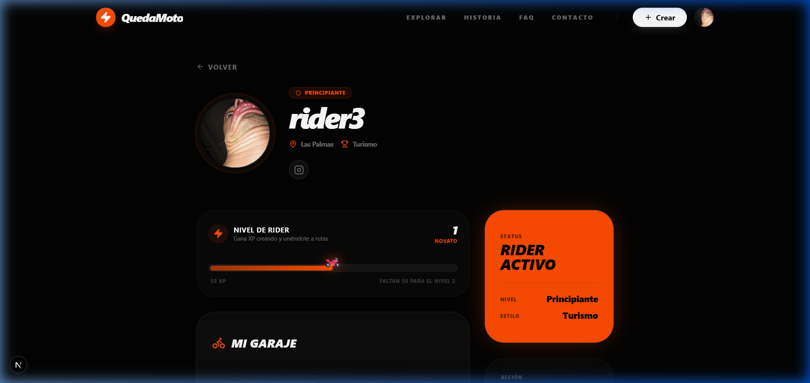
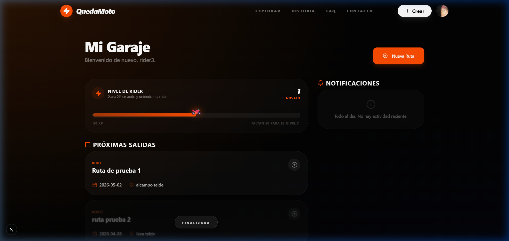

# 🏍️ QuedaMoto — La Red Social Motera Definitiva

> **Organiza rutas, conecta con riders y vive la pasión por las dos ruedas en una plataforma diseñada por y para moteros.**


[](https://quedamoto.vercel.app)
[](https://nextjs.org)
[](https://www.typescriptlang.org)
[](https://tailwindcss.com)

---

## 📸 Galería Visual

<div align="center">
  
  
  <br />
  
  
</div>

---

## 🚀 Características Principales

### 🏆 Gamificación y Sistema de XP
QuedaMoto no es solo una red social, es un juego. Cada acción en la plataforma te recompensa:
- **Niveles de Rider**: Desde *Novato* hasta *Leyenda del Asfalto*.
- **Barra de Progreso Dinámica**: Visualiza tu evolución en tiempo real en tu perfil y dashboard.
- **Puntos de Experiencia (XP)**: Gana XP participando en rutas, organizando quedadas y manteniendo la comunidad activa.
- **Insignias Exclusivas**: Desbloquea logros por hitos alcanzados.

### 🗺️ Explorador Inteligente y Filtros
Encuentra la ruta perfecta con un mapa interactivo de alto rendimiento:
- **Filtros Avanzados**: Filtra por nivel (Principiante, Intermedio, Pro), tipo de ruta (Café, Desayuno, Off-Road, Nocturna) y fecha.
- **Mapa en Tiempo Real**: Geolocalización precisa de puntos de encuentro.
- **UX Optimizada para Móvil**: Panel de filtros lateral (Sheet) para una navegación cómoda en ruta.

### 📢 Sistema de Banners y Patrocinios
Una plataforma pensada para crecer con la industria del motor:
- **Zonas de Publicidad**: Banners gestionables en el inicio (superior, medio, pie).
- **Nube de Sponsor**: Etiquetas dinámicas personalizables ("Sponsor", "Empresa", etc.).
- **Gestión desde Admin**: Activa, desactiva, edita o elimina banners sin tocar código.

### 💬 Comunicación y Comunidad
- **Chat Integrado**: Canal exclusivo para cada ruta para coordinar repostajes y paradas.
- **Notificaciones Push**: Alertas instantáneas de nuevos mensajes o cambios en tus rutas.
- **Perfiles Públicos**: Muestra tu garaje, tus estadísticas y tu reputación rider.

### 🛡️ Moderación Proactiva (Panel Admin 2.0)
- **Control Total**: Gestión de usuarios, mensajes, incidencias y reportes.
- **Estadísticas Avanzadas**: Tracking de visitas geolocalizado y exportación a Excel.
- **Branding Personalizado**: Cambia logo, título y configuración SEO desde el panel.

---

## 🛠️ Stack Tecnológico

| Componente | Tecnología |
| :--- | :--- |
| **Framework Core** | Next.js 16 (App Router + Turbopack) |
| **Frontend** | React 19 + TypeScript |
| **Estilos** | Tailwind CSS v4 (Aesthetic: Electric Orange & Mesh Gradients) |
| **Base de Datos** | PostgreSQL (Drizzle ORM) |
| **Autenticación** | NextAuth.js v5 (Auth.js) |
| **Mapas** | Mapbox GL JS / Leaflet |
| **Animaciones** | Framer Motion (Transiciones Premium) |
| **Infraestructura** | Vercel |

---

## ⚙️ Instalación y Configuración

```bash
# 1. Clonar el repositorio
git clone https://github.com/caspecor/QuedaMoto.git

# 2. Instalar dependencias
npm install

# 3. Configurar variables (.env.local)
# POSTGRES_URL, AUTH_SECRET, NEXT_PUBLIC_MAPBOX_TOKEN...

# 4. Sincronizar Base de Datos
npx drizzle-kit push

# 5. Modo Desarrollo
npm run dev
```

---

## 🎨 Identidad Visual (Branding)
QuedaMoto utiliza una paleta de colores curada para transmitir energía y modernidad:
- **Primary**: Electric Orange (`#ff4d00`)
- **Background**: Deep Onyx & Mesh Gradients
- **Typography**: Geist Sans & Outfit (Google Fonts)

---

## 📧 Contacto
¿Tienes una empresa del sector o quieres colaborar?
- **Email**: admin@quedamoto.com
- **Web**: [quedamoto.vercel.app](https://quedamoto.vercel.app)

---

<div align="center">
  <strong>🏍️ QuedaMoto — Tu próxima ruta empieza aquí 💨</strong>
</div>